# Cahier des Charges Technique et Fonctionnel

**Projet :** Plateforme izigsm — Gestion d'ateliers de réparation  
**URL cible :** https://izigsm.fr  
**Version :** 1.0  
**Date :** Juin 2026  
**Destinataire :** Équipe de développement  

---

## 1. Présentation générale

### 1.1 Objet du document

Ce document constitue le cahier des charges technique et fonctionnel de la plateforme **izigsm**. Il décrit l'ensemble des modules, flux de données, modèles métier, contraintes techniques et exigences non fonctionnelles nécessaires à l'implémentation de la solution. Il est destiné à être lu et exploité par des ingénieurs développeurs.

### 1.2 Périmètre

izigsm est une application web SaaS multi-tenant de gestion d'ateliers de réparation d'appareils électroniques. Elle couvre :

- La gestion opérationnelle (tickets de réparation, stock, approvisionnement)
- La gestion commerciale (facturation, devis, rachats)
- La relation client (CRM, agenda, SAV, communication)
- Le pilotage décisionnel (rapports, réseau multi-sites)
- La configuration métier (équipe, catalogue de services, vitrine publique)

### 1.3 Stack technique observée

| Couche | Technologie |
|--------|-------------|
| Type | SPA (Single Page Application) + API REST |
| Frontend | Framework JavaScript (React probable) |
| Rendu | Client-side rendering |
| Authentification | Email/password + OAuth 2.0 Google |
| PWA | Manifest + Service Worker (installable) |
| Hébergement | Cloud Europe (conformité RGPD) |
| Impression | QZ Tray (imprimantes thermiques locales) |
| Calendrier | iCal/webcal sync |
| Signature | eIDAS conforme |

---

## 2. Architecture système

### 2.1 Diagramme d'architecture globale

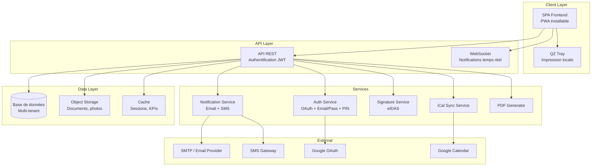

### 2.2 Modèle multi-tenant

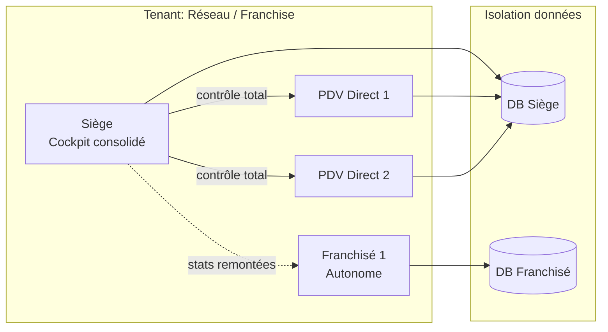

Chaque tenant (atelier) dispose d'un espace de données isolé. Le modèle réseau supporte trois niveaux hiérarchiques :

| Entité | Contrôle | Données | Accès cockpit |
|--------|----------|---------|---------------|
| Siège | Total sur PDV directs | Consolidées | Oui |
| PDV Direct | Opérationnel local | Partagées avec siège | Non |
| Franchisé | Autonome | Propres, stats remontées | Non |

---

## 3. Authentification et gestion des accès

### 3.1 Flux d'authentification

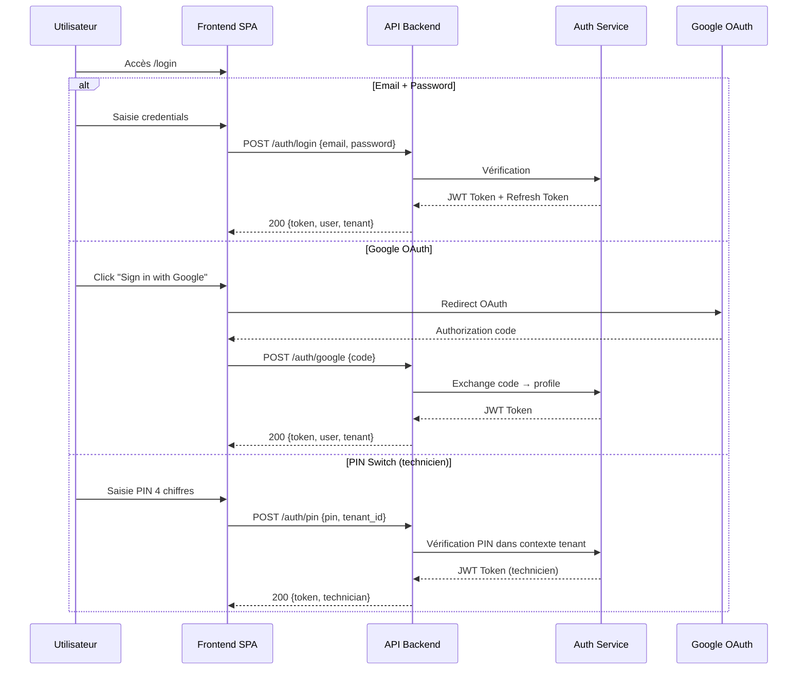

### 3.2 Modèle de rôles et permissions

| Rôle | Accès | Restrictions |
|------|-------|-------------|
| Propriétaire | Total | Aucune |
| Technicien | Opérationnel | Selon permissions granulaires |

Les permissions sont configurables par le propriétaire avec granularité par module (lecture, écriture, suppression). Le switch par PIN permet un changement rapide de contexte utilisateur sans déconnexion complète.

**Routes d'accès :**
- `/login` — Connexion propriétaire (email/password ou Google)
- `/tech/login` — Connexion technicien (email/password)
- PIN — Switch intra-session (pas de route dédiée, modal in-app)

---

## 4. Modèle de données principal

### 4.1 Entités et relations

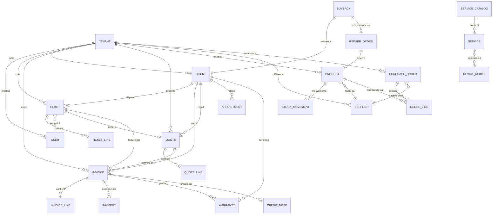

### 4.2 Entités principales — Spécifications

#### TENANT (Atelier)

| Champ | Type | Contrainte | Description |
|-------|------|-----------|-------------|
| id | UUID | PK | Identifiant unique |
| name | VARCHAR(255) | NOT NULL | Nom de l'atelier |
| slug | VARCHAR(100) | UNIQUE | URL publique /pro/:slug |
| logo_url | TEXT | NULLABLE | Logo de l'atelier |
| brand_color | VARCHAR(7) | DEFAULT #000 | Couleur de marque (hex) |
| invoice_prefix | VARCHAR(10) | NOT NULL | Préfixe factures (ex: FA) |
| quote_prefix | VARCHAR(10) | NOT NULL | Préfixe devis (ex: DEV) |
| credit_note_prefix | VARCHAR(10) | NOT NULL | Préfixe avoirs (ex: AV) |
| deposit_prefix | VARCHAR(10) | NOT NULL | Préfixe acomptes (ex: AC) |
| numbering_separator | CHAR(1) | DEFAULT '-' | Séparateur numérotation |
| numbering_date_format | VARCHAR(10) | NOT NULL | Format date dans numéro |
| counter_digits | INT | DEFAULT 2 | Nb chiffres compteur |
| trial_ends_at | TIMESTAMP | NULLABLE | Fin période d'essai |
| subscription_plan | ENUM | NOT NULL | Plan actif |
| device_types | JSONB | NOT NULL | Types d'appareils réparés |
| created_at | TIMESTAMP | NOT NULL | Date de création |

#### TICKET (Prise en charge)

| Champ | Type | Contrainte | Description |
|-------|------|-----------|-------------|
| id | UUID | PK | Identifiant unique |
| tenant_id | UUID | FK → TENANT | Atelier |
| client_id | UUID | FK → CLIENT | Client déposant |
| assigned_to | UUID | FK → USER, NULLABLE | Technicien assigné |
| status | ENUM | NOT NULL | Statut workflow |
| device_type | VARCHAR(50) | NOT NULL | Type d'appareil |
| device_brand | VARCHAR(100) | NULLABLE | Marque |
| device_model | VARCHAR(100) | NULLABLE | Modèle |
| imei | VARCHAR(20) | NULLABLE | IMEI si applicable |
| issue_description | TEXT | NOT NULL | Description du problème |
| diagnosis | TEXT | NULLABLE | Diagnostic technicien |
| deposit_amount | DECIMAL(10,2) | DEFAULT 0 | Acompte versé |
| tracking_token | VARCHAR(64) | UNIQUE | Token lien de suivi client |
| created_at | TIMESTAMP | NOT NULL | Date de création |
| updated_at | TIMESTAMP | NOT NULL | Dernière modification |
| archived_at | TIMESTAMP | NULLABLE | Date d'archivage |

**Statuts du workflow ticket :**

```
INTAKE → DIAGNOSIS → TO_ORDER → ORDERED → PARTS_RECEIVED → IN_REPAIR → READY_TO_RETURN → RETURNED
```

#### INVOICE (Facture)

| Champ | Type | Contrainte | Description |
|-------|------|-----------|-------------|
| id | UUID | PK | Identifiant unique |
| tenant_id | UUID | FK → TENANT | Atelier |
| client_id | UUID | FK → CLIENT | Client facturé |
| ticket_id | UUID | FK → TICKET, NULLABLE | Ticket lié |
| number | VARCHAR(30) | UNIQUE per tenant | Numéro séquentiel |
| type | ENUM | NOT NULL | repair, sale, buyback |
| status | ENUM | NOT NULL | draft, issued, partial, paid, cancelled |
| total_ht | DECIMAL(10,2) | NOT NULL | Total HT |
| total_ttc | DECIMAL(10,2) | NOT NULL | Total TTC |
| vat_amount | DECIMAL(10,2) | NOT NULL | Montant TVA |
| issued_at | TIMESTAMP | NULLABLE | Date d'émission (verrouillage) |
| due_at | TIMESTAMP | NULLABLE | Date d'échéance |
| locked | BOOLEAN | DEFAULT false | Verrouillé après émission |
| warranty_months | INT | DEFAULT 0 | Durée garantie |
| created_at | TIMESTAMP | NOT NULL | Date de création |

**Règle métier critique :** Une fois `issued_at` renseigné, le champ `locked` passe à `true` et aucune modification n'est autorisée (conformité fiscale française). La numérotation est strictement séquentielle sans trou.

#### PRODUCT (Produit/Pièce)

| Champ | Type | Contrainte | Description |
|-------|------|-----------|-------------|
| id | UUID | PK | Identifiant unique |
| tenant_id | UUID | FK → TENANT | Atelier |
| name | VARCHAR(255) | NOT NULL | Nom du produit |
| sku | VARCHAR(50) | NULLABLE | Référence interne |
| barcode | VARCHAR(50) | NULLABLE | Code-barres |
| family | ENUM | NOT NULL | piece, accessory, device_new, device_used, software, consumable |
| supplier_id | UUID | FK → SUPPLIER, NULLABLE | Fournisseur principal |
| purchase_price_ht | DECIMAL(10,2) | NOT NULL | Prix d'achat HT (CUMP) |
| selling_price_ht | DECIMAL(10,2) | NOT NULL | Prix de vente HT |
| vat_rate | DECIMAL(4,2) | DEFAULT 20.00 | Taux TVA |
| quantity_in_stock | INT | DEFAULT 0 | Quantité en stock |
| stock_alert_threshold | INT | DEFAULT 0 | Seuil d'alerte stock bas |
| last_movement_at | TIMESTAMP | NULLABLE | Dernier mouvement |
| created_at | TIMESTAMP | NOT NULL | Date de création |

**Calcul du CUMP :** À chaque réception de commande fournisseur :
```
nouveau_cump = (ancien_stock × ancien_cump + qté_reçue × prix_achat) / (ancien_stock + qté_reçue)
```

---

## 5. Modules fonctionnels — Spécifications détaillées

### 5.1 MOD-01 : Prises en charge (Tickets)

**Priorité : CRITIQUE**

#### Workflow

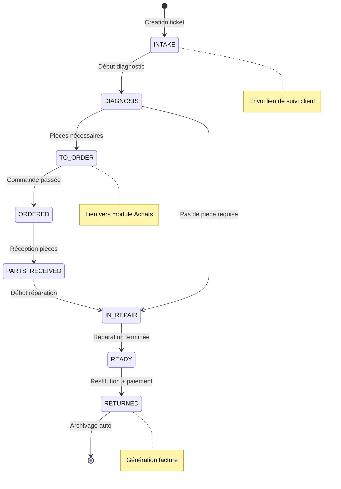

#### Endpoints API requis

| Méthode | Route | Description |
|---------|-------|-------------|
| GET | `/api/tickets` | Liste paginée avec filtres (status, technician, date_range) |
| GET | `/api/tickets/:id` | Détail d'un ticket |
| POST | `/api/tickets` | Création (mode rapide ou complet) |
| PATCH | `/api/tickets/:id` | Mise à jour (dont changement de statut) |
| PATCH | `/api/tickets/:id/assign` | Assignation technicien |
| POST | `/api/tickets/:id/archive` | Archivage |
| GET | `/api/tickets/kanban` | Vue Kanban groupée par statut |
| GET | `/api/tracking/:token` | Suivi client public (pas d'auth) |

#### Règles métier

1. Le passage au statut `RETURNED` nécessite un paiement complet ou un avoir.
2. L'archivage est automatique lorsque le ticket est `RETURNED` ET le solde est à zéro.
3. Les indicateurs d'ancienneté sont calculés depuis `created_at` : vert (< 2j), orange (3–7j), rouge (> 7j), alerte clignotante (> 14j).
4. Le lien de suivi est envoyé automatiquement au client à la création si l'automatisation est active.
5. Les noms de statuts sont personnalisables par tenant (stockés dans la config tenant).

---

### 5.2 MOD-02 : Facturation

**Priorité : CRITIQUE**

#### Flux de facturation

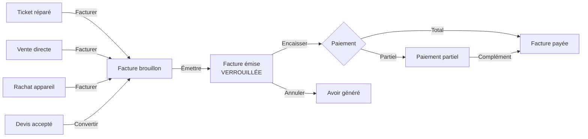

#### Numérotation

Le format est configurable par tenant avec les paramètres suivants :

```
{prefix}{separator}{date_format}{separator}{counter}
```

Exemples :
- `FA-06-2026-01` (facture)
- `AC-06-2026-01` (acompte)
- `DEV-06-2026-01` (devis)
- `AV-06-2026-01` (avoir)

**Contrainte d'intégrité :** Le format est verrouillé dès le premier document émis. Le compteur est strictement incrémental sans trou possible (même en cas d'annulation — l'annulation génère un avoir, pas une suppression).

#### Endpoints API requis

| Méthode | Route | Description |
|---------|-------|-------------|
| GET | `/api/invoices` | Liste avec filtres (status, payment_status, type, date_range) |
| GET | `/api/invoices/:id` | Détail facture |
| POST | `/api/invoices` | Création brouillon |
| POST | `/api/invoices/:id/issue` | Émission (verrouillage) |
| POST | `/api/invoices/:id/payments` | Enregistrer un paiement |
| POST | `/api/invoices/:id/cancel` | Annulation → génère avoir |
| GET | `/api/invoices/kpis` | KPIs : CA, encaissements, retards |
| GET | `/api/invoices/export` | Export CSV/Excel |
| POST | `/api/invoices/send-accountant` | Envoi au comptable |

---

### 5.3 MOD-03 : Devis

**Priorité : HAUTE**

#### Cycle de vie

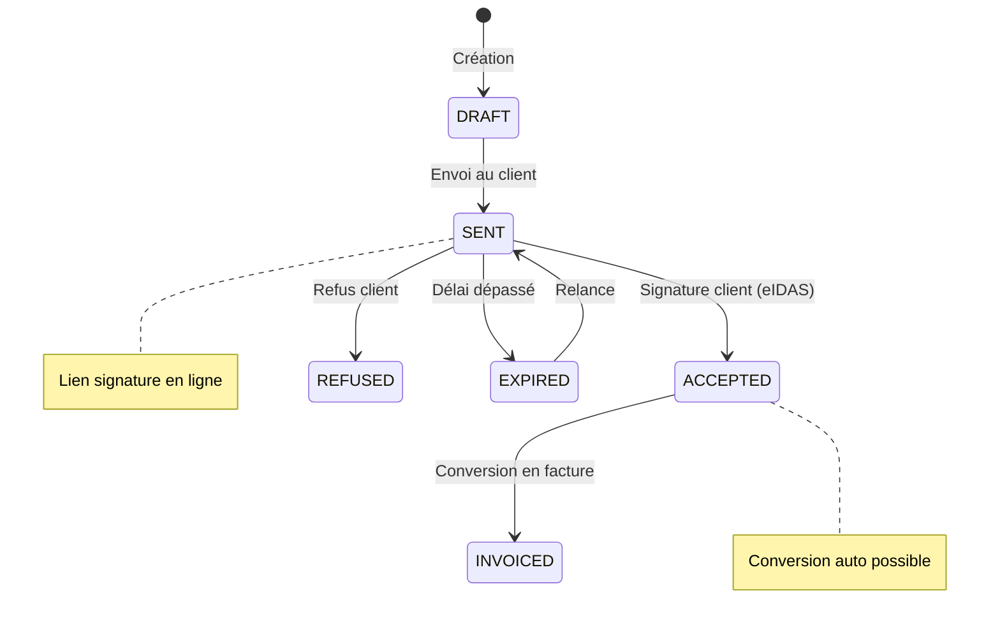

#### Endpoints API

| Méthode | Route | Description |
|---------|-------|-------------|
| GET | `/api/quotes` | Liste avec filtres |
| POST | `/api/quotes` | Création |
| POST | `/api/quotes/:id/send` | Envoi au client |
| POST | `/api/quotes/:id/convert` | Conversion en facture |
| GET | `/api/quotes/public/:token` | Page publique signature |
| POST | `/api/quotes/public/:token/accept` | Acceptation + signature |
| POST | `/api/quotes/public/:token/refuse` | Refus |
| POST | `/api/quotes/request` | Demande de devis publique (vitrine) |

---

### 5.4 MOD-04 : Stock et Catalogue

**Priorité : CRITIQUE**

#### Mouvements de stock

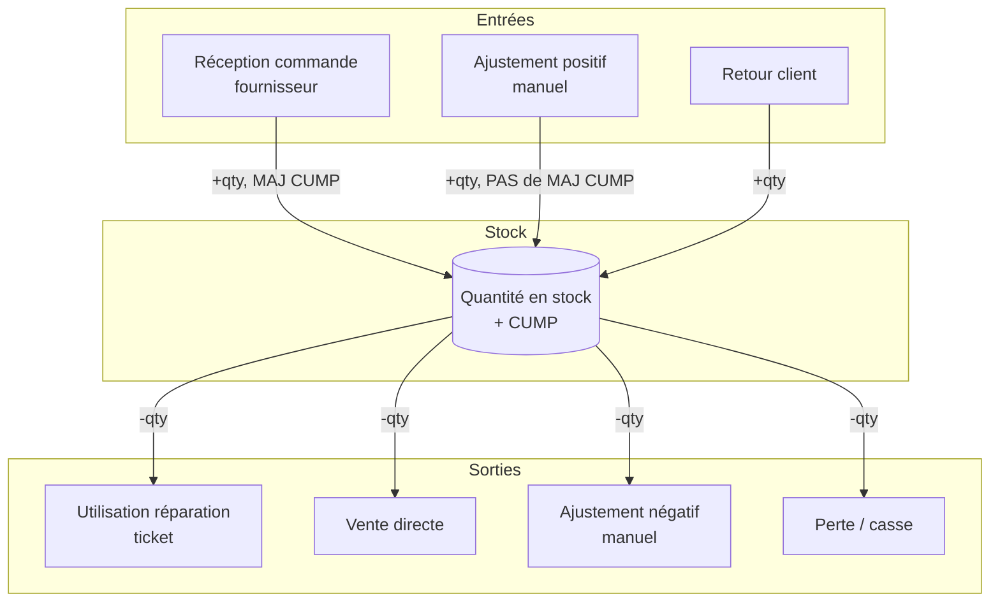

**Règle importante :** Seule la réception de commande fournisseur met à jour le CUMP. L'ajustement manuel corrige la quantité mais ne modifie pas le coût moyen.

#### KPIs Dashboard Stock

| Indicateur | Calcul |
|-----------|--------|
| Valeur stock HT | Σ (quantity × purchase_price_ht) |
| Valeur stock TTC | Σ (quantity × purchase_price_ht × (1 + vat_rate/100)) |
| Marge potentielle | Σ (quantity × (selling_price_ht - purchase_price_ht)) |
| Stock dormant | Produits avec last_movement_at < NOW() - 90 jours |
| Alertes stock bas | Produits avec quantity ≤ stock_alert_threshold |
| Ruptures | Produits avec quantity = 0 ET stock_alert_threshold > 0 |

---

### 5.5 MOD-05 : Reconditionnement

**Priorité : MOYENNE**

#### Flux

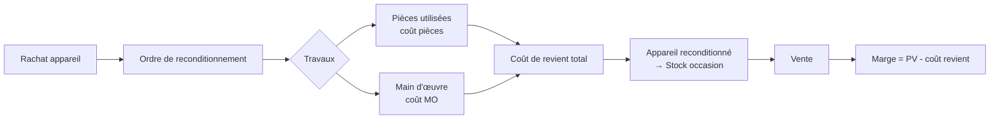

| Statut | Description |
|--------|-------------|
| `in_progress` | Reconditionnement en cours |
| `finalized` | Terminé, en stock |
| `sold` | Vendu |
| `cancelled` | Annulé |

---

### 5.6 MOD-06 : Rachats (Livre de police)

**Priorité : HAUTE**

#### Contraintes réglementaires

Le livre de police est une obligation légale pour les professionnels achetant des biens d'occasion. Chaque rachat doit enregistrer :

| Champ obligatoire | Description |
|-------------------|-------------|
| Date d'acquisition | Horodatage du rachat |
| Identité du vendeur | Nom, prénom, adresse, pièce d'identité |
| Description de l'objet | Type, marque, modèle |
| IMEI / N° série | Identifiant unique de l'appareil |
| Prix d'achat | Montant payé |
| N° séquentiel | Numéro dans le registre |

#### Endpoints

| Méthode | Route | Description |
|---------|-------|-------------|
| GET | `/api/buybacks` | Liste avec filtres (status, search IMEI/name) |
| POST | `/api/buybacks` | Création rachat |
| PATCH | `/api/buybacks/:id` | Mise à jour |
| POST | `/api/buybacks/:id/sell` | Marquer comme vendu |
| GET | `/api/buybacks/kpis` | Indicateurs |

---

### 5.7 MOD-07 : Clients (CRM)

**Priorité : HAUTE**

#### Modèle CLIENT

| Champ | Type | Description |
|-------|------|-------------|
| id | UUID | PK |
| tenant_id | UUID | FK → TENANT |
| first_name | VARCHAR(100) | Prénom |
| last_name | VARCHAR(100) | Nom |
| company | VARCHAR(255) | Société (nullable) |
| email | VARCHAR(255) | Email (nullable) |
| phone | VARCHAR(20) | Téléphone (format international E.164) |
| address | JSONB | Adresse structurée |
| is_archived | BOOLEAN | Archivé |
| referral_code | VARCHAR(20) | Code parrainage |
| referred_by | UUID | FK → CLIENT (nullable) |
| created_at | TIMESTAMP | Création |

#### Fonctionnalités

- Import CSV/Excel avec mapping de colonnes
- Recherche full-text sur nom, société, téléphone, email
- Historique consolidé : tickets, factures, devis, RDV, SAV, communications
- Parrainage : code unique par client, suivi des filleuls

---

### 5.8 MOD-08 : Agenda et Rendez-vous

**Priorité : MOYENNE**

#### Statuts rendez-vous

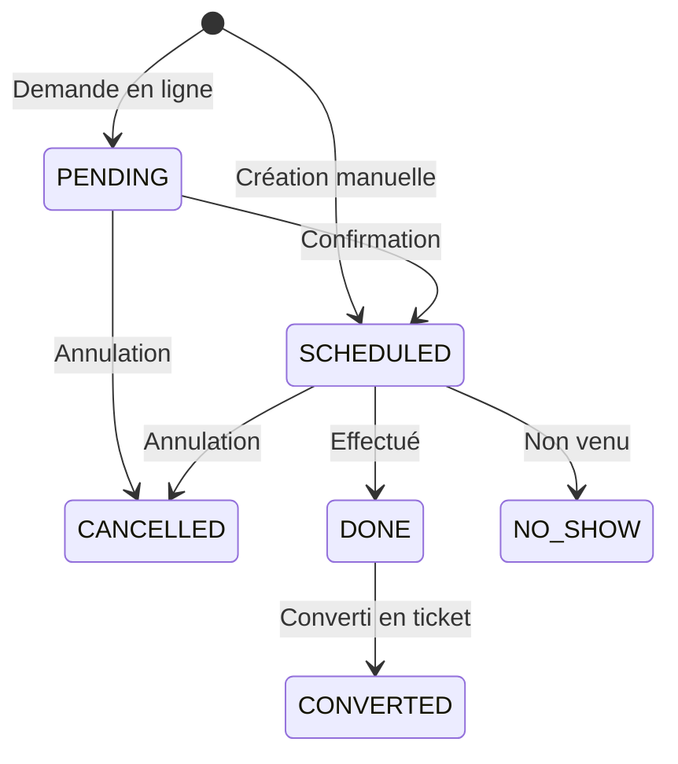

#### Synchronisation calendrier

Export iCal/webcal en lecture seule vers :
- Google Calendar
- Apple Calendrier
- Microsoft Outlook

URL : `webcal://izigsm.fr/api/calendar/:tenant_id/:token.ics`

---

### 5.9 MOD-09 : SAV et Garanties

**Priorité : MOYENNE**

#### Flux SAV

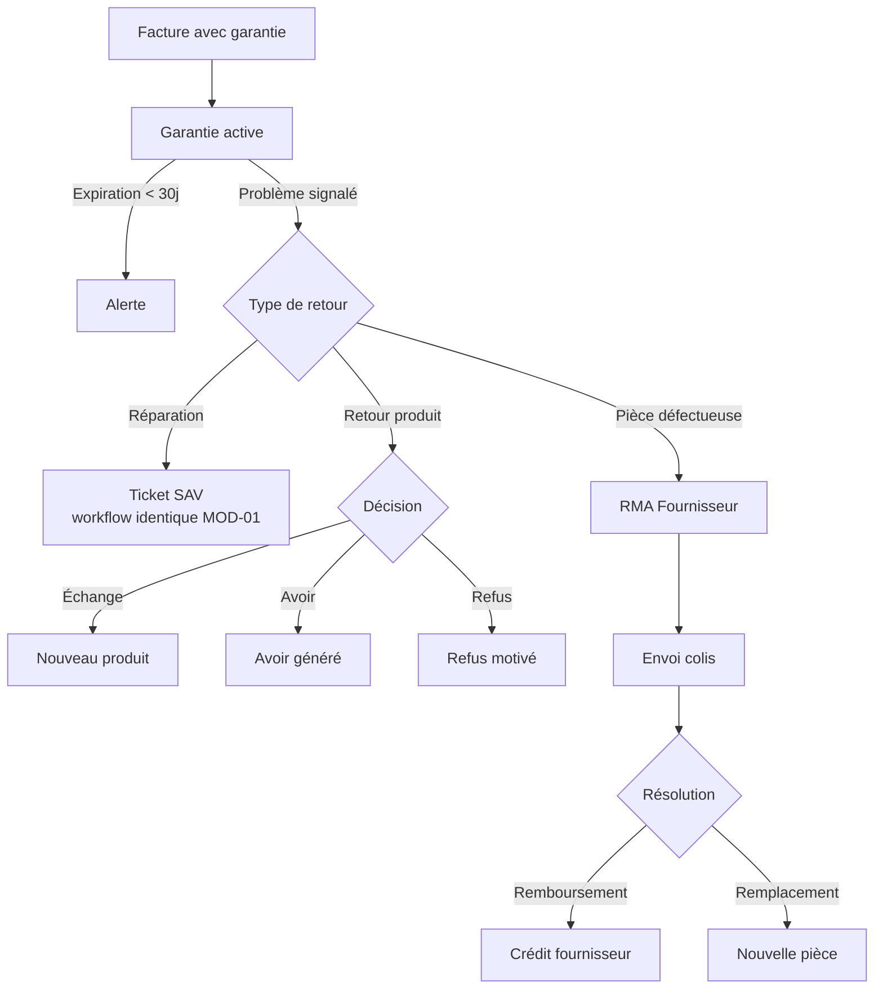

---

### 5.10 MOD-10 : Achats et Approvisionnement

**Priorité : HAUTE**

#### Cycle d'approvisionnement

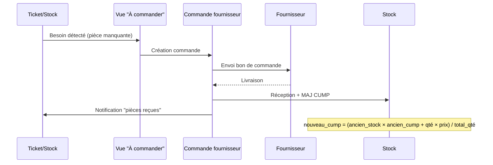

#### États commande fournisseur

| Statut | Description |
|--------|-------------|
| `draft` | Brouillon en préparation |
| `awaiting_delivery` | Envoyée, en attente |
| `received` | Réceptionnée (stock MAJ) |
| `cancelled` | Annulée |

#### États paiement fournisseur

| Statut | Description |
|--------|-------------|
| `pending` | En attente de règlement |
| `partial` | Partiellement réglé |
| `paid` | Intégralement réglé |

---

### 5.11 MOD-11 : Avoirs et Bons d'achat

**Priorité : BASSE**

| Type | Utilisation | Expiration |
|------|-------------|-----------|
| Avoir de remboursement | Annulation facture | Non |
| Bon d'achat | Geste commercial, retour | Oui (configurable) |

Statuts : `active` → `completed` (utilisé) ou `expired` (date dépassée).

Numérotation séquentielle identique aux factures (préfixe AV).

---

### 5.12 MOD-12 : Communication et Automatisations

**Priorité : HAUTE**

#### Architecture notifications

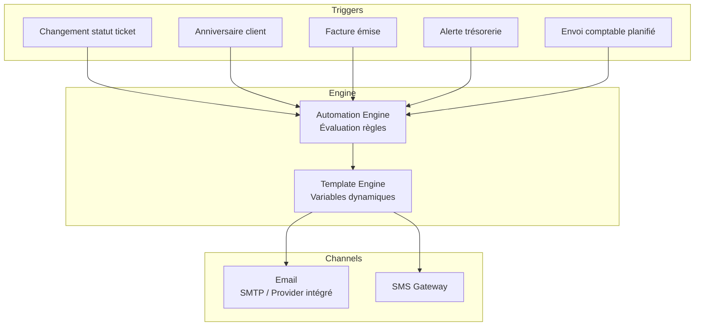

#### Configuration email

| Mode | Description | Complexité |
|------|-------------|-----------|
| Infrastructure izigsm | Email géré par la plateforme | Aucune config |
| Adresse personnalisée | Domaine client, DNS guidé | Moyenne |
| SMTP expert | Serveur SMTP client | Avancée |

---

### 5.13 MOD-13 : Caisse (POS)

**Priorité : MOYENNE**

#### Flux d'encaissement

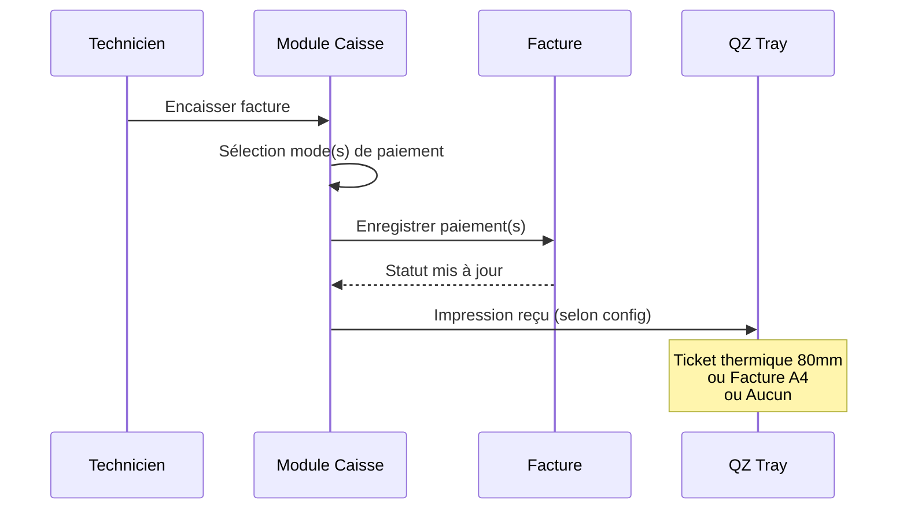

#### Intégration QZ Tray

QZ Tray est un bridge Java local permettant l'impression directe sur imprimantes thermiques depuis le navigateur via WebSocket local (`wss://localhost:8181`).

| Fonctionnalité | Format |
|---------------|--------|
| Ticket de caisse | Thermique 80mm |
| Étiquette réparation | 62×40mm |
| Étiquette stock | 62×40mm |
| Facture | A4 PDF |

---

### 5.14 MOD-14 : Site vitrine et Réservation

**Priorité : MOYENNE**

#### Routes publiques

| Route | Fonction |
|-------|----------|
| `/pro/:slug` | Page vitrine atelier |
| `/pro/:slug/services` | Catalogue public |
| `/pro/:slug/booking` | Prise de RDV en ligne |
| `/pro/:slug/depot` | Dépôt à distance (colis) |
| `/pro/:slug/devis` | Demande de devis avec photos |

Ces routes sont publiques (pas d'authentification requise). Elles alimentent les modules internes (Agenda, Devis, Tickets).

---

### 5.15 MOD-15 : Rapports et Exports

**Priorité : HAUTE**

#### Catégories de rapports

| Catégorie | Exports disponibles |
|-----------|-------------------|
| Activité | Tickets par période, par technicien, temps moyen |
| Caisse POS | Journal de caisse quotidien, modes de paiement |
| Comptabilité | Factures, marge détaillée, prestations, stock |
| Conformité | Archives verrouillées, livre de police |

#### Filtres communs

| Paramètre | Valeurs |
|-----------|---------|
| Période | today, 7d, month, custom (date_start, date_end) |
| Format | CSV, XLSX |
| Technicien | user_id (optionnel) |
| Type facture | repair, sale, buyback (optionnel) |
| Statut paiement | unpaid, partial, paid (optionnel) |

---

### 5.16 MOD-16 : Réseau et Multi-sites

**Priorité : MOYENNE**

#### Endpoints réseau

| Méthode | Route | Description |
|---------|-------|-------------|
| GET | `/api/network/overview` | Cockpit consolidé |
| POST | `/api/network/pdv` | Créer un PDV direct |
| POST | `/api/network/invite` | Inviter un franchisé |
| POST | `/api/network/switch` | Switch de PDV (avec PIN) |
| GET | `/api/network/compare` | Vue comparative KPIs |

---

### 5.17 MOD-17 : Catalogue de services

**Priorité : HAUTE**

#### Structure

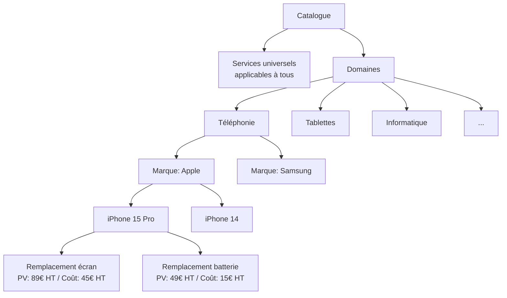

Chaque service possède un prix de vente HT et un prix de revient HT permettant le calcul de marge.

---

### 5.18 MOD-18 : Gestion d'équipe

**Priorité : MOYENNE**

#### Modèle USER

| Champ | Type | Description |
|-------|------|-------------|
| id | UUID | PK |
| tenant_id | UUID | FK → TENANT |
| email | VARCHAR(255) | Email de connexion |
| password_hash | VARCHAR(255) | Hash bcrypt |
| pin | CHAR(4) | PIN switch rapide (nullable) |
| role | ENUM(owner, technician) | Rôle |
| permissions | JSONB | Permissions granulaires |
| is_active | BOOLEAN | Compte actif |
| stats | JSONB | Statistiques calculées |

---

## 6. Exigences non fonctionnelles

### 6.1 Performance

| Métrique | Objectif |
|----------|----------|
| Disponibilité | 99.9% (SLA) |
| Temps de réponse API (P95) | < 500ms |
| Temps de chargement initial | < 3s (LCP) |
| Requêtes concurrentes par tenant | Jusqu'à 50 |

### 6.2 Sécurité

| Exigence | Implémentation |
|----------|---------------|
| Chiffrement transit | TLS 1.3 obligatoire |
| Chiffrement repos | AES-256 pour données sensibles |
| Authentification | JWT avec refresh token rotation |
| Injection SQL | ORM + requêtes paramétrées |
| XSS | CSP headers + sanitization |
| CSRF | Token CSRF sur mutations |
| Rate limiting | Par IP et par tenant |
| Audit trail | Log de toutes les mutations critiques |

### 6.3 Conformité réglementaire

| Réglementation | Exigence |
|---------------|----------|
| CGI (Code Général des Impôts) | Numérotation séquentielle, verrouillage post-émission, anti-fraude |
| RGPD | Hébergement UE, consentement cookies, droit à l'oubli, export données |
| eIDAS | Signature électronique qualifiée pour devis |
| Livre de police | Registre des achats d'occasion avec identité vendeur |

### 6.4 Scalabilité

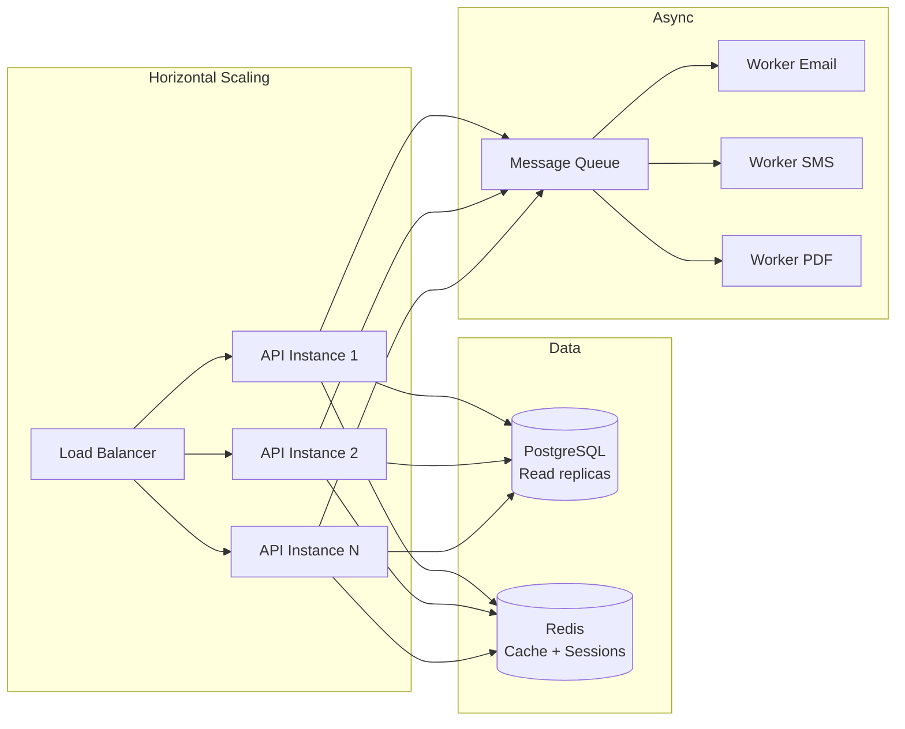

---

## 7. Interfaces externes

### 7.1 Intégrations requises

| Service | Protocole | Usage |
|---------|-----------|-------|
| Google OAuth 2.0 | HTTPS/REST | Authentification |
| SMTP (configurable) | SMTP/TLS | Envoi emails |
| SMS Gateway | HTTPS/REST | Envoi SMS |
| QZ Tray | WSS local | Impression thermique |
| iCal | webcal:// | Sync calendrier |
| Signature eIDAS | HTTPS/REST | Signature devis |
| Export comptable | Email + pièces jointes | Envoi périodique |

### 7.2 API publiques exposées

| Route | Auth | Usage |
|-------|------|-------|
| `/api/tracking/:token` | Non | Suivi client |
| `/api/quotes/public/:token/*` | Non | Signature devis |
| `/pro/:slug/*` | Non | Vitrine publique |
| `/api/calendar/:tenant/:token.ics` | Token | Sync calendrier |
| `/api/booking/:tenant` | Non | Prise de RDV |

---

## 8. Contraintes de déploiement

| Paramètre | Valeur |
|-----------|--------|
| Hébergement | Cloud provider Europe (AWS eu-west, GCP europe-west, OVH) |
| Base de données | PostgreSQL 15+ (recommandé) |
| Cache | Redis 7+ |
| Object Storage | S3-compatible (documents, photos, logos) |
| CDN | Pour assets statiques SPA |
| CI/CD | Pipeline automatisé (tests, build, deploy) |
| Monitoring | APM + alerting (erreurs, latence, disponibilité) |
| Backup | Snapshots DB quotidiens, rétention 30 jours minimum |
| Environnements | dev, staging, production |

---

## 9. Glossaire technique

| Terme | Définition |
|-------|-----------|
| CUMP | Coût Unitaire Moyen Pondéré — méthode de valorisation du stock |
| eIDAS | Règlement européen sur l'identification électronique et les services de confiance |
| IMEI | International Mobile Equipment Identity — identifiant unique d'appareil mobile |
| KPI | Key Performance Indicator |
| POS | Point Of Sale — point de vente / caisse |
| PWA | Progressive Web App — application web installable |
| RMA | Return Merchandise Authorization — retour fournisseur |
| SPA | Single Page Application |
| Tenant | Entité locataire dans une architecture multi-tenant |
| RGPD | Règlement Général sur la Protection des Données |

---

*Document généré le 1er juin 2026 — Version 1.0*
